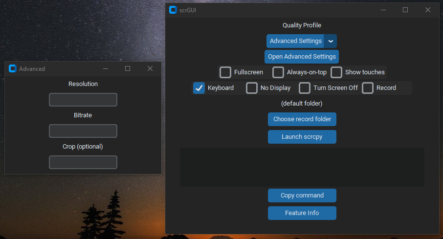

 # scrGUI                                                                                                            
Stupidly Simple GUI for Scrcpy

**scrGUI** is a lightweight, launcher for [scrcpy](https://github.com/Genymobile/scrcpy), designed for creators, testers, and tinkerers who want instant Android mirroring without the command line.

- Click-to-launch scrcpy with custom settings
- Save profiles for different devices or workflows
- No Python or ADB install required — just run `scrGUI.exe`
- Record Option, with native FPS

*!!NOTE: For some reason Windows Defender has detected my program as malicious, i have no idea for this reason as im not that good in programming, however if you know what the issue is please let me know so i can fix it, thank you. (used pyinstaller to compile the .py to .exe)!!*

## Key Features
Profiles
- Low: 640p / 2 Mbps
- Medium: 1080p / 4 Mbps
- High: 1920p / 8 Mbps
- Performance: 1920p / 16 Mbps - screen off, max throughput
(best for laptop screen-based gaming)
- Advanced: Custom resolution, bitrate, crop (saved persistently)

Toggles
- Fullscreen: Immersive monitor fill
- Always-on-top: Keeps window above others
- Show touches: Displays tap indicators

Options
- Keyboard: OTG passthrough typing
- No Display: Input only, no video
- Turn Screen Off: Saves battery & GPU
- Record: Timestamped video, optional folder

Advanced
- Custom res/bitrate: Fine-tune quality
- Record folder: Choose save location
- Crop: Focus on region (--crop w:h:x:y)
Example: --crop 720:1280:0:0
→ Captures a 720×1280 region from top-left corner

Combos
- Performance + Record: High-quality gameplay capture
- No Display + Keyboard: Passthrough typing
- Fullscreen + Always-on-top: Best for calls or reference
- Crop + Record: Focused app capture
- Touches + Record: Tutorial/demo videos

The .exe file is a portable package, so no need to install the app. 
I create this since most GUI based apps didnt have the features i wanted, hence i had to use the command line (which was really annoying after a while)

If you have any feature requests, give me a message on Discord (user: mekylepain)
